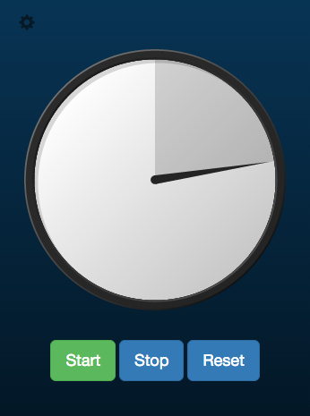

# timer
An animated timer app using javascript and electron

You can run project in a conventional browser, without main.js, or using electron as a standalone app.  I have electron installed globally, so in terminal I just have to type "electron ." to run it.
